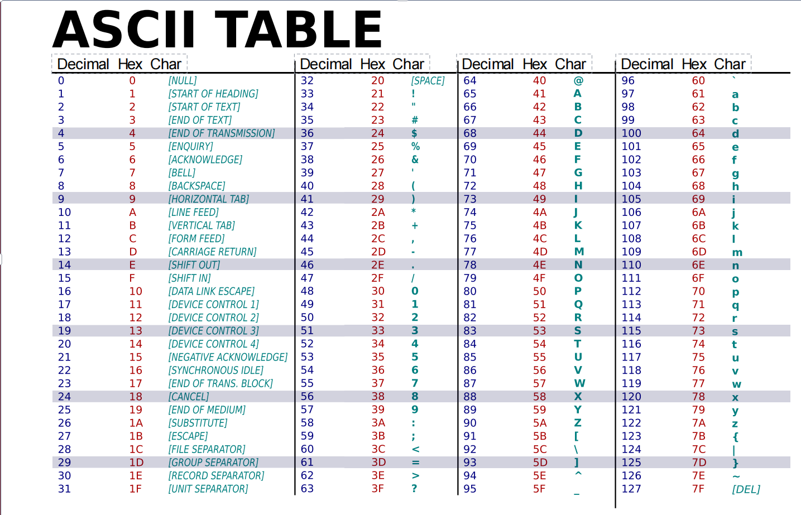

### $Hardware:$

#### $Central~Processing~Unit:$

##### $Arithmetic~Logic~Unit\\Control~Unit\\Registers$

#### $Memory:$

##### $Cache~(Static~Random~Access~Memory(SRAM))\\Read~Only~Memory~(ROM)\\Random~Access~Memory~(RAM)\\Dynamic~Random~Access~Memory~(DRAM)$

#### $Peripheral:$

##### $Input~Devices:Keyboard,Mouse,Scanner,Microphone,etc\\Output~Devices:Monitor,Printer,Sound,etc\\External~Storage:Solid-state~disk(SSD),Hard~disk(HDD),Floppy~disk(obsolete),CD,USB~Flash~Disk,etc\\Internet~Devices:Network~Adapter,Modem,etc$

#### $Memory~Hierarchy:$

##### $From~small~to~Large:$

- Register
- Cache inside the core:L1 cache(**SRAM**)
- Cache outside the core:L2 cache(**SRAM**)
- DRAM
- Local Disk
- Remote Storage

##### $From~fast~to~slow:$

- L1 cache
- L2 cache
- L3 cache
- RAM
- Disk Cache
- Disk

#### $Hard~Disk:$

##### $$Disk~Access~Time=Seek~Time+Rotation~Time+Transfer~Time+Contraller~Overhead$$

- Seek Time:Time to position head to correct track
- Ratation Time:Time for disk to rotate to proper sector
- Transfer Time:Time for data to rotate usder the head

##### $$Average~rotation~time=\frac{1}{2}time~of~a~rotation$$

- 7200 Revolutions Per minute $\rightarrow$ 120 Rev/sec
- 1 revolution = $\frac{1}{120}$sec$\rightarrow$8.33ms
- $\frac{1}{2}$rotation(revolution)$\rightarrow$4.17ms

### $Computer~Language:$

#### $Binary~Representation:$

##### $bite(b)\\byte(B)\\kilobyte(KB)\\megabyte(MB)\\gigabyte(GB)\\terabyte(TB)\\petabyte(PB)\\exabyte(EB)\\zettabyte(ZB)\\yottabyte(YB)$

#### $2's~Complement:$

##### $To~negative:$

- use Complement to minus the number and add 1
- **e.g.**：77=0b01001101 -77=0b11111111-0b01001101+1=0b10110011

#### $ASCII~TABLE:$

