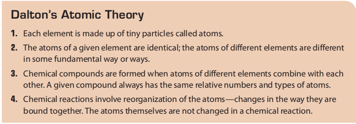
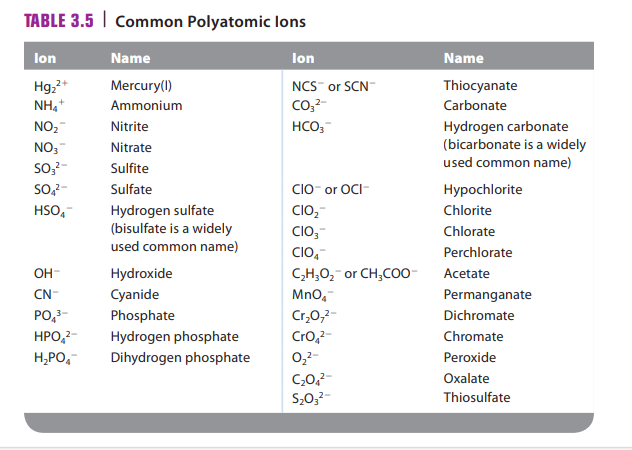

### $化学史：$

#### $Dalton ~ Atomic ~ Theory:$

### $命名:$

#### $前缀：$

$1: mono-$
$2: di-$
$3: tri-$
$4: tetra-$
$5: penta-$
$6: hexa-$
$8: octa-$

#### $非金属元素：$

$O^{2-}: Oxide$
$S^{2-}: Sulfide$
$F^{-}: Fluoride$
$Cl^{-}: Chloride$
$Br^{-}: Bromide$
$I^{-}: Iodide$
$N^{3-}: Nitride$

#### $金属元素：$

$Na: Sodium$

#### $VESPR ~ Theory:$

$直线型：Linear$
$平面三角形：Trigonal ~ planar$
$平面四边形：Square ~ planar$
$四面体形：Tetrahedral$
$三角锥形：Trigonal ~ pyramidal$
$四棱锥：Square ~ pyramidal$
$三角双锥形：Trigonal ~ bipyramidal$
$八面体形：Octahedral$
$T形：T-Shaped$
$V形：Bent/V-Shaped$

### $中英文对照：$

光子：Photon
质子：Proton
中子：Neutron
电子：Eletrons
声子：Phonon
有效核电荷：Effective nuclear charge
原子半径：Atomic radius
电离能：Lonization energies
离子键：Lonic bonding
极性共价键：Polar covalent bond
电负性：Electronegativity
形式电荷：Formal Charge
原子价电子数：Valence Electrons
原子上未参与化学键的电子数：Non-bond in Electrons
与其他原子共享的电子数：Bonding Electrons
分子轨道：Molecular Orbital
分子轨道模型：Molecular Orbital Model

冷凝管：Condenser

顺磁性：Paramagnetic

溶剂：the Common Solvent
溶解：Dissolve
水合：Hydration
溶解度：Solubility
非离子物质：
电导率：Electrical conductivity
电解质：Electrolytes
强电解质：Strong electrolytes
弱电解质：Weak electrolytes
标准溶液：Standard solution

### $Calculation:$

$$Formal ~ Charge = Valence ~ Electrons - Non-bond ~ in ~ Electrons -0.5*Bonding ~ Electrons$$

$\\$

$$
Persent ~ inoic ~ character=\left(\frac{measured ~ dipole ~ moment ~ of ~ X-Y}{calculated ~ dipole ~ moment ~ of ~ X^+Y^-}\right)*100\%
$$

$\\$

$$
Molarity(M)=\frac{moles~of~solute}{liters~of~solute}
$$

### $Molecular ~ Orbital ~ Theory:$

键级： Bond order

$$Bond ~ order = \frac {number ~ of ~ bonding ~ eletrons - number ~ of ~ antibonding ~ eletrons}{2}$$

### $GAS:$

$R=0.08206\dfrac{L·atm}{K·mol}\\
\text{Boyle's Law}:PV=K\\
\text{Charles's Law}:V=k_1T\\
\text{Avogadro's Law}:V=k_2n=k_3m\\
\text{The Ideal Gas Law}:V=R\left(\dfrac{Tn}{P}\right)\iff PV=nRT\\
\text{STP(standard tempareture and pressure)}:V_{0}=\dfrac{nRT}{P}\\
$

### $单位换算：$

$$1~atm=760~mm~Hg=760~torr=101325~Pa=29.92~in~Hg=14.7~lb/in^2\\
1~L=61.0237~in^3$$